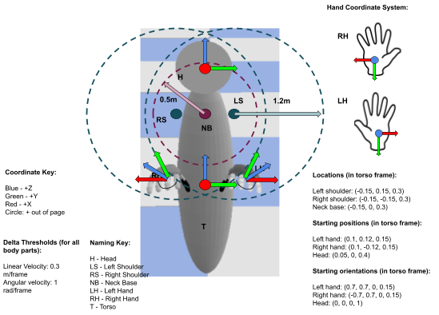
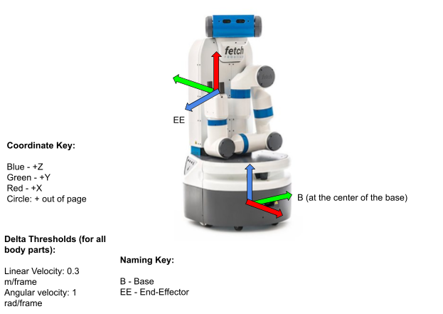

# Embodiments: actuation, sensing, grasping

In principle, any robot embodiment can be used to participate in BEHAVIOR.
We provide two embodiments, the `BehaviorRobot` and the `FetchRobot`, fully implemented and functional.
Consider adding your own robot following the instructions [here]().

## BehaviorRobot

The BehaviorRobot is composed of two hands, a torso, and a head where the cameras are mounted.
It has been used as avatar for humans to collect demos in virtual reality (more info [here](vr_demos.md)), but can also be controlled by an autonomous AI agent to participate in the BEHAVIOR. 

### Degrees of Freedom

The embodiment has 26 degrees of freedom decomposed as follows:
- Base: 6 DoF pose (position, orientation)
- Head: 6 DoF pose (position, orientation) - relative to the current torso frame
- Left and right hands: 6 DoF pose each - relative to the current torso frame
- Left and right grippers: 1 DoF of close/open (aperture) of each gripper that correspond to the synchronized actuation of the 5 fingers

Reference frames for the robot state in the BehaviorRobot:

### Actuation and Control

Base, head, and hands are directly controlled in Cartesian space.
We provide a control interface for agents to control the motions of the BehaviorRobot by specifying:
- Base: Desired change in pose (delta pose, 6D) relative to the base frame in the previous time step.
- Head: Desired change in pose (delta pose, 6D) relative to the base frame
- Hands: Desired change in pose (delta pose, 2 x 6D) relative to the base frame
- Grippers: Binary variable (2 x 1D) specifying if the grippers should close or open (change the gripper aperture DoF) at maximum speed

## FetchRobot

Fetch is composed of a mobile base, one arm and a movable head where the cameras are mounted.
It models the real robot Fetch.

### Degrees of Freedom

The embodiment has 12 degrees of freedom decomposed as follows:
- Base: the base moves by actuating two active wheels. However, at effects of actuation and robot state, the rotation of the wheels is not relevant to the user; we consider instead the 3 DoF corresponding to the position on the floor plane and rotation around the floor plane normal
- Trunk: 1 DoF of a prismatic joint that affect to both arm and head
- Head: 2 DoF of pan (horizontal) & tilt (vertical) directions
- Arm: 6 DoF (revolute joints) for the arm that control the motion of the right hand
- Gripper: 1 DoF of close/open (aperture) of the two-fingered gripper

Reference frames for the robot state in the BehaviorRobot:

### Actuation and Control

TODO!!!!!
Base, head, and hands are directly controlled in Cartesian space.
We provide a control interface for agents to control the motions of the BehaviorRobot by specifying:
- Base: Desired change in pose (delta pose, 6D) relative to the base frame in the previous time step.
- Head: Desired change in pose (delta pose, 6D) relative to the base frame
- Hands: Desired change in pose (delta pose, 2 x 6D) relative to the base frame
- Grippers: Binary variable (2 x 1D) specifying if the grippers should close or open (change of the gripper aperture DoF) at maximum speed

## Observations

Both agent embodiments have similar sensing capabilities based on virtual sensors on-board:
- Agent's vision (default: 128x128 resolution, 120 degree FoV)
    - RGB images
    - Depth images
    - Semantic and instance segmentation images
    - Activity relevant object mask (all objects included in the activity definition except the agent and the floor)
- BehaviorRobot's proprioception:
    - Hand/end-effector pose in base frame (12-dim)
    - Head pose in base frame (6-dim)
    - Hand closing fraction (2-dim)
    - Whether the hand is grasping (2-dim)
- FetchRobot's proprioception:
    - Hand/end-effector pose in base frame (6-dim)
    - Hand aperture state (1-dim for FetchRobot)
    - Joint states (9-dim for FetchRobot: trunk, head and arm joints)
    
## Grasping Modes

We acknowledge grasping as one of the most difficult elements in the physical interaction between the agents and the environment.
To alleviate the difficulty and enable research in other areas (e.g. planning, perception,...), we propose three grasping modes for BEHAVIOR:
- **Physical Grasping**: This mode does not make any simplification in the grasping process. 
Grasping is the result of a fully simulated interactions between the agent's hand/fingers and the objects.
This mode is the most difficult but also the most realistic.

- **Assistive Grasping**: We simplify the grasping process with a mechanism that creates a rigid connection between the agent's hand and an object if: 1) the gripper DoF is closed over a threshold, and 2) the object is "inside" the hand. The joint created by assistive grasping between hand and object is removed if the constraint is violated because of a large force or because the object and the hand move apart (the physics engine cannot enforce the rigid connection due to other constraints), or when the grasping DoF goes under the activation threshold.
  The definition of "inside the hand" depends on the embodiment:
    - For BehaviorRobot: an object object is "inside the hand" if it is intersected by rays projected from the palm to the fingertips of the hand, and the hand is applying a non-zero force to it.
    - For FetchRobot: and object "inside the hand" if it is in contact with both fingers of the end-effector, and the contact point is in the inner part of the fingers.
  Assistive grasping simplifies the interaction but forces the agent to move in a realistic way to succeed in the grasp by placing the objects inside the hands, between the fingers.

- **Sticky Mitten**: An alternative simplified grasping that creates a rigid connection between the hand and an object if the grasping DoF goes over a threshold while the hand is in contact with the object.
Using the sticky mitten, agents do not need to place the fingers around an object to grasp it.

## Add your own embodiment!

You can add your own embodiment to BEHAVIOR. For that, you will need to add it to iGibson following the specific instructions [here]() (coming soon!).

